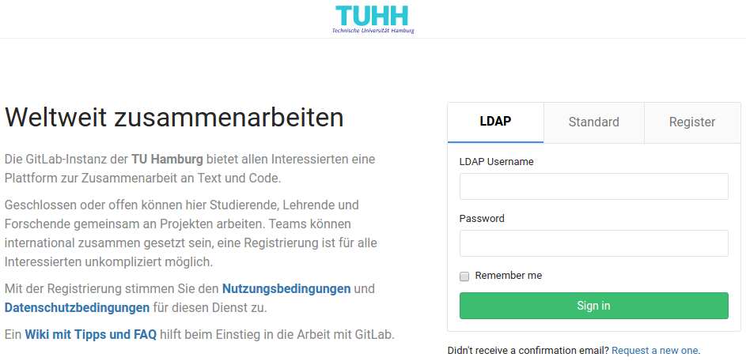

[GitLab](https://gitlab.com) ist eine freie Software, die das kollaborative Entwickeln von Software und Texten ermöglicht. Sie ist das freie und offene Pendant zu [GitHub](https://github.com), das von einer Firma gehostet wird. Viele Programme, die wir täglich nutzen und die aus dem Internet nicht wegzudenken sind, [werden mit Hilfe von GitHub entwickelt](https://github.com/explore). Viele davon sind Open Source oder sogar [Freie Software](http://www.gnu.org/philosophy/free-sw.html).

Seit 2016 hat die TUHH [ihre eigene GitLab-Installation](https://collaborating.tuhh.de). Dort liegt auch [der Quelltext für dieses Veranstaltungsskript](https://collaborating.tuhh.de/itbh/oer/informatik/einfuehrung-in-die-informationstechnik-i-wise-2021_22).

Ich bin überzeugt, das jeder, der heute beginnt, sich für informatische Inhalte und Zusammenhänge zu interessieren, an GitHub und GitLab nicht vorbei kommt. Denn hinter diesen Namen stecken nicht nur weitere Internetplattformen. Vielmehr etablieren die Konzepte eine neue Kulturtechnik der Kollaboration und des Teilens, die auch für Lehr-Lernzusammenhänge nutzbar gemacht werden kann. Nicht ohne Grund gibt es daher auch ein [GitHub Education Programm](https://education.github.com/) und die [GitLab University](https://docs.gitlab.com/ce/university/#gitlab-university).

Wir werden uns mit GitLab vertraut machen und uns langsam die Funktionen dieser Plattform erschließen. Dafür ist es notwendig, dass sich alle Studierenden ein GitLab-Account zulegen.

### Auftrag

* Melden Sie sich bei [GitLab an der TUHH](https://collaborating.tuhh.de/) mit Ihrem TUHH-Account an.
  * Wir werden GitLab in einer geschützten Umgebung verwenden. D.h. Ihre Arbeit darin wird im Zusammenhang mit der Veranstaltung nicht öffentlich sein.
  * Wählen Sie ggf. eine [Email-Adresse, die Sie nur für die Arbeit mit Plattformen und Tools im Studium verwenden werden](../mailadresse).
  * Lesen Sie dabei die Terms of Service sowie die Datenschutzerklärung von GitLab durch, wenn Sie sich anmelden.
