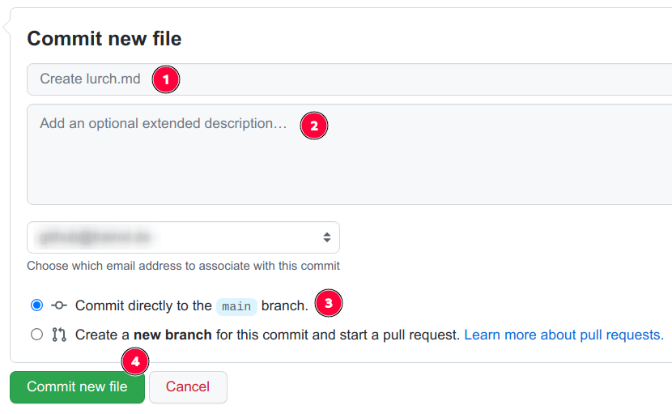
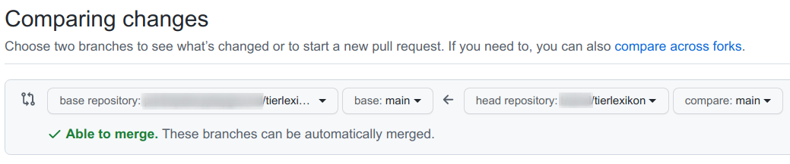

In dieser Einheit lernen Sie die Oberfläche von GitHub sowie einige zentrale Konzepte von Git und GitHub kennen.

## Ziele

- Sie reflektieren Ihre Erwartungen an die Zusammenarbeit und das Konzept des Lernangebots.
- Sie registrieren sich bei GitHub.
- Sie experimentieren mit den Sichtbarkeitseinstellungen Ihres Accounts.
- Sie treten einem Team in einer Organisation bei.
- Sie diskutieren mit anderen Teammitgliedern (*Teamdiskussion*).
- Sie formulieren Issues in einem Repository und antworten auf die Issues anderer Teammitglieder.
- Sie fügen einem fremden Repository eine neue Datei hinzu (Fork, Pull request).
- Sie erläutern zentrale Konzepte der Oberfläche von GitHub (Pull request, Issue, Fork etc.).
- Sie installieren [die Software auf Ihren Rechnern, die im Lernmaterial verwendet wird](../../voraussetzungen/software/).

## Video: An Introduction to GitHub

In dem folgenden Video erläutere ich den Aufbau der typischen Landingpage eines GitHub-Repositorys sowie zentrale Konzepte der Zusammenarbeit mit Git und GitHub.

<iframe src='https://www.youtube.com/embed//qj9-Nn8rJyc' frameborder='0' allowfullscreen></iframe>

## Aufträge

{}
Das Arbeiten mit Git, GitHub und GitLab bringt es mit sich, zahlreiche neue Fachtermini zu lernen, hinter denen sich teilweise komplexe Workflows und Konzepte verbergen. Die folgende Anwendung macht es vielleicht leichter, sich diese "Vokabeln" draufzuschaffen.
{}
{}

{}
1. Verfassen Sie in unserem `veranstaltungsrepository` ein neues Issue, in dem Sie eine mögliche Projektidee beschreiben. Wählen Sie einen aussagekräftigen Titel und eine werbende Beschreibung mit einigen ersten Stichpunkten zu Ihrem Vorhaben.
2. Suchen Sie sich ein Issue von einem anderen Teammitglied aus. Antworten Sie darauf mit einer Nachfrage, einer Idee, mit anerkennenden Worten oder mit dem Vorschlag, gemeinsam an der Idee zu arbeiten.
{}

{}
1. Schauen Sie sich die [Settings](https://github.com/settings/profile) für Ihren GitHub-Account an. Probieren Sie einige Einstellungen aus, und sehen Sie sich anschließend die Darstellung Ihres Profils an,
   - wenn Sie in GitHub angemeldet sind.
   - wenn Sie nicht in GitHub angemeldet sind.
2. Stellen Sie Fragen, und tauschen Sie sich aus in der Teamdiskussion.
{}

{}
1. Installieren Sie [die Software](../../voraussetzungen/software/), die Sie für dieses Lernmaterial auf Ihren eigenen Rechnern benötigen. 
2. Sollten Sie dabei Schwierigkeiten haben, machen Sie Screenshots von den Fehlermeldungen. Posten Sie diese in der Teamdiskussion.
{}

{}
In der ersten Übung zur Kollaboration auf GitHub geht es um das gemeinsame Entwickeln eines Buchs mit dem Thema "Tierlexikon". Jede:r soll mindestens ein neues Tier hinzufügen. Neu ist, dass Sie Fork und Pull request manuell anstoßen.

### Der Fork 

1. Wechseln Sie im Browser in das Repository `tierlexikon`.
2. Klicken Sie oben rechts im Browser auf den Button *Fork*. Wählen Sie anschließend den Account für den Fork.
3. Analysieren Sie in Ihrer neuen Kopie die Dateien und Ordner, um die Struktur des Repositorys zu verstehen.
4. Fügen Sie nun notwendige Ordner und Datei für weitere Tiere in dieser Struktur hinzu. Sie können beim Anlegen neuer Dateien auch gleich neue Ordner anlegen, indem Sie den Pfad ergänzen:  
   
5. Generieren Sie Inhalt in Ihren neuen Dateien, wobei Sie sich an den beiden vorhandenen Dateien `kaninchen.md` und `igel.md` orientieren.
6. Schließen Sie den Vorgang mit einer sinnvollen Commit message ab, und wählen Sie die Optionen, wie in der Abbildung zu sehen:  
   
7. Wiederholen Sie die Schritte für weitere Dateien. Ändern Sie vorhandene Dateien in Ihrem Fork, wann immer es nötig ist.

### Der Pull request

Wenn Sie finden, dass Ihr Fork "reif" ist für einen Pull request, stoßen Sie diesen manuell an.

1. Wechseln Sie in Ihrem Fork auf die Seite *Pull requests*.
2. Starten Sie einen neuen Pull request mit Klick auf *New pull request*.
3. Auf der folgenden Seite können Sie nun sehen (von rechts nach links gelesen), dass Sie von Ihrem Fork in Richtung *base repository* den "Antrag zum Mergen", also den Pull request stellen:  
   
4. Klicken Sie auf *Create pull request*.
5. Geben Sie auf der folgenden Seite einen sinnvollen Titel ein wie "Add Lurch". Probieren Sie auch aus, einen Kommentar zu schreiben. Prüfen Sie dann, wo dieser wieder auftaucht.
6. Schließen Sie den Vorgang mit einem erneuten Klick auf *Create pull request* unterhalb des Formulars ab.

Sie landen anschließend auf der Seite *Pull requests* des *base repositorys*.

### Pull request aktualisieren

Solange wie der Pull request noch nicht gemergt wurde, können Sie ihn jederzeit aktualisieren.

1. Editieren Sie eine Datei aus dem Pull request **in Ihrem Fork**. 
2. Prüfen Sie, ob und wie diese Änderung **im base repository** zu finden ist!

{}

## Deadline

Der Auftrag ist bis zum **Dienstag, 19.04.2022**, zu erledigen.