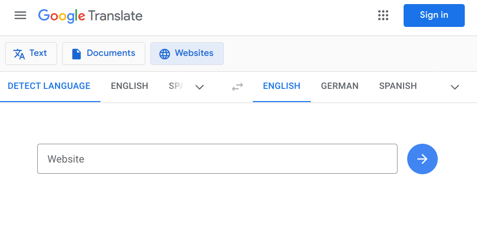

In dieser Einheit lernen Sie das Potenzial von **Reviews** kennen. **Pandoc** wird als exemplarische Software eingeführt, um zu zeigen, wie aus Quellcode (hier: Markdown) digitale Artefakte (hier: verschiedene Dokumenttypen) gebaut werden. In einem Exkurs geht es um **freie Lizenzen** von Medien.

## Ziele

- Sie handeln Qualitätsstandards für Beiträge zu einem Projekt aus.
- Sie diskutieren in Reviews über die Qualität von Pull requests.
- Sie überarbeiten Ihre Pull requests gemäß der Kritik, die in Reviews formuliert wird (*im Browser*[^1]).
- Sie wählen Medien und im Besonderen Bilder aus, die mit [Creative Commons-Lizenzen](https://creativecommons.org/) kompatibel sind, und zeichnen diese entsprechend aus.
- Sie wenden die Syntax von Markdown korrekt an.
- Sie setzen Übersetzungstools ein, um technische Dokumentationen in anderen Sprachen zu lesen.

[^1]: Später werden Sie Möglichkeiten kennenlernen, diese Überarbeitungen auch auf Ihrem lokalen Rechner zu machen.

## Weiterführende Informationen

- Offizielle GitHub-Dokumentation zu Pull requests und Reviews: [Reviewing changes in pull requests](https://docs.github.com/en/pull-requests/collaborating-with-pull-requests/reviewing-changes-in-pull-requests)
- Offizielle GitHub-Dokumentation zum Einarbeiten von Feedback: [Incorporating feedback in your pull request](https://docs.github.com/en/pull-requests/collaborating-with-pull-requests/reviewing-changes-in-pull-requests/incorporating-feedback-in-your-pull-request)
- [Markdown Cheat Sheet](https://www.markdown-cheatsheet.com/)
- Blogbeitrag [OER leichtgemacht mit der TULLU-Regel](https://open-educational-resources.de/oer-tullu-regel/), um Quelle und Lizenz von Medien unter Creative Commons rechtssicher anzugeben

## Aufträge

{}
Beschäftigen Sie sich mit den weiterführenden Informationen. Sie helfen Ihnen, die Inhalte des Praxisteils besser zu verstehen und die folgenden Aufträge souverän zu bearbeiten.
{}

{}
1. Rufen Sie [die offizielle GitHub-Dokumentation](https://docs.github.com/en/pull-requests/collaborating-with-pull-requests/reviewing-changes-in-pull-requests) auf.
2. Probieren Sie [Google Translate](https://translate.google.com/?sl=auto&tl=en&op=websites) zum Übersetzen der Seite in eine andere Sprache aus, indem Sie die URL kopieren und bei Google einfügen.  
  
  *Beachten Sie, dass auch Fachbegriffe übersetzt werden. Daher ist zu empfehlen, die Originalseite in einem anderen Tab geöffnet zu haben, um die Übersetzung gelegentlich abzugleichen.*
{}

{}
Nachdem Sie Forks und Pull requests ausprobiert und sich gegenseitig in Reviews Kritik gegeben haben, setzen Sie diese Verbesserungsvorschläge und Anregungen nun um. Dafür können Sie die Dateien in Ihrem stehenden Pull request erneut bearbeiten.

1. Lesen Sie zunächst die entsprechende Seite [Incorporating feedback in your pull request](https://docs.github.com/en/pull-requests/collaborating-with-pull-requests/reviewing-changes-in-pull-requests/incorporating-feedback-in-your-pull-request) in der GitHub-Dokumentation.
1. Nutzen Sie die *Reply*-Funktionen von Kommentaren in Reviews, um ggf. Rückfragen an die Gutachter:innen zu stellen.
1. Probieren Sie auch die Funktion **Commit suggestion** aus! Was passiert?
1. Fordern Sie von Ihren Reviewer:innen ein neues Review ein:  
  
1. Notieren Sie alle Ihre Fragen, oder stellen Sie sie im Chat unseres Teams.

{}
