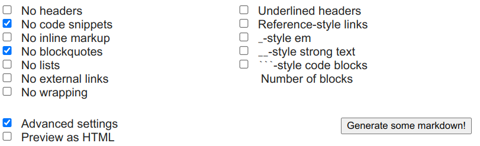

## Was bisher geschah

In der bisherigen Zusammenarbeit ist noch nicht deutlich geworden, worin der ganze Aufwand gipfelt, den Sie betrieben haben. Sie haben anfangs eine Kopie bzw. einen Fork des `tierlexikons` erstellt, um anschließend darin einen eigenen Beitrag vorzubereiten. Mit einem Pull request haben Sie dann beim Upstream-Repository, dem Original, darum gebeten, dass Ihr Beitrag integriert bzw. gemergt wird. Auf dem Weg dahin haben Sie in Reviews gegenseitig Anmerkungen zur Qualität der Beiträge gemacht und diese immer weiter verbessert.

Nun ist es an der Zeit, die Pull requests anzunehmen, was der Maintainer des Upstream-Repos machen kann. Damit fließen alle Beiträge in ein großes Ganzes zusammen, Ihr Tierlexikon.

Aber wie können Sie sehen und prüfen, was Sie da gemeinsam bauen?

In der agilen Software- und Textentwicklung ist es entscheidend, dass Zwischenergebnisse aus der Zusammenarbeit häufig erstellt und gesichtet werden können. Denn ein zentraler Aspekt von Agilität ist das Lernen und Reflektieren der Zwischenstände. Nur so entsteht ein geteiltes Verständnis des gemeinsamen Handelns, weil alle immer wieder das unfertige Produkt sehen und diskutieren.

## GitHub Actions

Um diesen Aspekt von Agilität mit GitHub einzulösen, nutzen wir ab jetzt **GitHub Actions**. In diesem Bereich der Plattform können Workflows konfiguriert werden, die durch bestimmte Ereignisse in der Arbeit angestoßen werden. Sie führen in der Regel dazu, dass das Produkt *gebaut* wird. Am Ende steht ein *Artefakt* zur Verfügung, dass Sie sich in unserem Fall herunterladen und im Browser anzeigen können.

Das Tierlexikon wird mithilfe von Pandoc gebaut. Dabei werden alle Markdown-Dateien in ein HTML-Dokument konvertiert. Später sind weitere Formate denkbar, z. B. epub oder PDF.

## Den Fork aktuell halten

Ein weiterer Handlungsschritt ist das regelmäßige Synchronisieren des Forks mit dem Upstream-Repository. Denn nur so kann die Kopie aktuell gehalten werden und neue Beiträge integrieren, die von Anderen stammen. 

Sie sollten immer daran denken, den aktuellen Stand von Upstream in Ihren Fork zu mergen, bevor Sie mit der Weiterarbeit beginnen. Das ist [in der Dokukmentation von GitHub](https://docs.github.com/en/pull-requests/collaborating-with-pull-requests/working-with-forks/syncing-a-fork#syncing-a-fork-from-the-web-ui) gut beschrieben und illustriert.

## Ziele

- Sie synchronisieren Ihren Fork mit dem Upstream-Repository, um ihn aktuell zu halten.
- Sie erläutern die Idee von GitHub Actions und lesen eine Konfigurationsdatei.
- Sie laden Artefakte aus GitHub Workflows für ihren Fork und für Upstream herunter.
- Sie schreiben Issues, um die Erkenntnisse aus der Sichtung der Artefakte festzuhalten und zu diskutieren.

[^1]: Später werden Sie Möglichkeiten kennenlernen, diese Überarbeitungen auch auf Ihrem lokalen Rechner zu machen.

## Weiterführende Informationen

- [Offizielle GitHub-Dokumentation zu Actions](https://docs.github.com/en/actions/learn-github-actions/understanding-github-actions)
- [Offizielle GitHub-Dokumentation zum Synchronisieren von Forks](https://docs.github.com/en/pull-requests/collaborating-with-pull-requests/working-with-forks/syncing-a-fork)
- [Lorem-Ipsum-Generator für komplexere Markdown-Dokumente Lorem Markdownum](https://jaspervdj.be/lorem-markdownum/)

## Aufträge

{}
Beschäftigen Sie sich mit den weiterführenden Informationen. Sie helfen Ihnen, die Inhalte des Praxisteils besser zu verstehen und die folgenden Aufträge souverän zu bearbeiten.
{}

{}
In diesem Auftrag geht es darum, mit den bisher erlangten Kenntnissen und Fertigkeiten Routine zu erlangen. Sie werden analog zum Tierlexikon nun in einem neuen Projekt ein **Blumenlexikon** zusammentragen. Dabei kommen alle Handlungen noch einmal vor, die Sie auch schon in der Entwicklung des Tierlexikons kennengelernt haben.

1. Forken Sie das Projekt `blumenlexikon`.
2. Ergänzen Sie einen neuen Artikel über eine Blume. Nutzen Sie dabei den Blindtextgenerator [Lorem Markdownum](https://jaspervdj.be/lorem-markdownum/) mit folgenden Einstellungen, und machen Sie sich mit den Inhalten Ihres Beitrags keine Mühe. Es geht um das Erlangen von Routine in den bisher gelernten Abläufen!
   
3. Suchen Sie ein Bild zu Ihrer Pflanze im Netz, das unter einer Creative-Commons-Lizenz steht, die mit unserer CC BY-SA 4.0-Lizenz kompatibel ist.
4. Fügen Sie das Bild ein, und geben Sie die Lizenz korrekt nach der TULLU-Regel an.
5. Formatieren Sie das Dokument nach unseren Qualitätsrichtlinien, wobei Sie auch auf die korrekten Überschriftenniveaus achten.
6. Stellen Sie einen Pull request von Ihrem Fork auf Upstream.
7. Laden Sie jemanden ein, ein Review zu Ihrem Beitrag zu schreiben. Aktualisieren Sie dann den Beitrag nach diesen Anmerkungen.
8. Achten Sie darauf, Ihren Fork ggf. mit Upstream zu synchronisieren.
{}

{}
Das Upstream-Repo vom `blumenlexikon` enthält schon die Konfiguration für den regelmäßigen Bau des Lexikons.

1. Laden Sie aus dem Upstream-Repo das Artefakt herunter, wobei Sie über den Reiter *Actions* den entsprechenden Workflow aufrufen.
2. Laden Sie auch in Ihrem Fork das Artefakt herunter, um ihre Arbeit im Gesamtbild zu betrachten.  
  **Wichtig:** Sie müssen die Workflows erstmalig aktivieren, nachdem Sie geforkt haben. Die Workflows beginnen dann nach Ihrer nächsten Änderung zu laufen.
{}

{}
Durch die Ansicht der Artefakte lernen Sie, was besser oder anders gemacht werden muss. Halten Sie diese Erkenntnisse in Issues des Upstream-Repos fest. 

- Machen Sie, wenn sinnvoll und möglich, Screenshots, um die Fundstellen besser beschreiben zu können, und fügen Sie sie in das Issue ein.
- Wenn Sie wissen, was anders muss, gibt es zwei Möglichkeiten:  
  a.) Sie machen es selbst und stellen einen Pull request.  
  b.) Sie beschreiben den Sachverhalt und bitten um Diskussion.

{}
