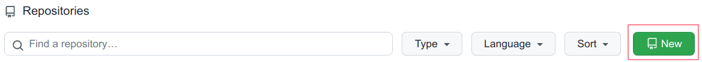
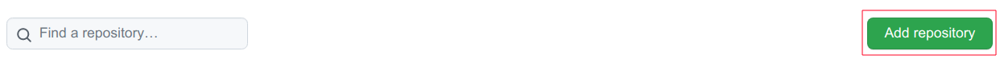

Jetzt geht es darum, die neuen Kenntnisse auf die Arbeit an eigenen Projekten zu transferieren!

## Ziele

- Sie installieren [VSCodium](https://vscodium.com/) auf Ihrem Rechner.
- Sie richten selbständig neue Repositorys ein.
- Sie entwickeln eine aussagekräftige README-Datei.
- Sie klonen ein neues Repository auf Ihren Rechner, um es lokal zu bearbeiten. Anschließend pushen Sie die Änderungen.

## Weiterführende Informationen

- [First steps with git: clone, add, commit, push](https://www.earthdatascience.org/workshops/intro-version-control-git/basic-git-commands/)

## Aufträge

{}
1. Installieren Sie [VSCodium](https://vscodium.com/) auf Ihrem Rechner.
3. Forken Sie ein beliebiges Repository auf GitHub. 
4. Klonen Sie anschließend Ihren Fork auf Ihren Rechner, entweder per Kommandozeile/Terminal oder aus VSCodium. 
5. Öffnen Sie die README-Datei, und machen Sie darin irgendeine Änderung.
6. Committen und pushen Sie diese Änderung.
7. Sehen Sie auf GitHub nach, ob die Änderung dort sichtbar geworden ist.
{}

{}
1. Legen Sie ein neues Repository an, wenn Sie Maintainer\*in Ihres Teams sind.  
   
   - Der Owner ist `participatoryplayground`!
   - Der Name des Repos lautet `[teamname]-warmlaufen`, wobei Sie `[teamname]` durch Ihren Teamnamen **ohne** die eckigen Klammern ersetzen.
   - Das neue Repo soll auch über eine README-Datei verfügen.
2. Navigieren Sie nun in Ihr Team, und fügen Sie auf dem Reiter *Repositories* mit dem Button *Add repositories* das neue Repository dem Team hinzu. Diesen Button haben Sie nur als Maintainer\*in.  
   
3. Maintainer\*innen: Informieren Sie Ihr Team in Ihrer Teamdiskussion über den aktuellen Stand.
3. Lokal arbeiten:
   - Maintainer\*innen: Klonen Sie das Upstream-Repo auf Ihren Rechner.
   - Member: Forken Sie das Upstream-Repo, und klonen Sie den Fork auf Ihren Rechner.
4. Arbeiten Sie in Ihrer Gruppe eine README-Datei aus, die erläutert, worum es in Ihrem Projekt geht.
{}
